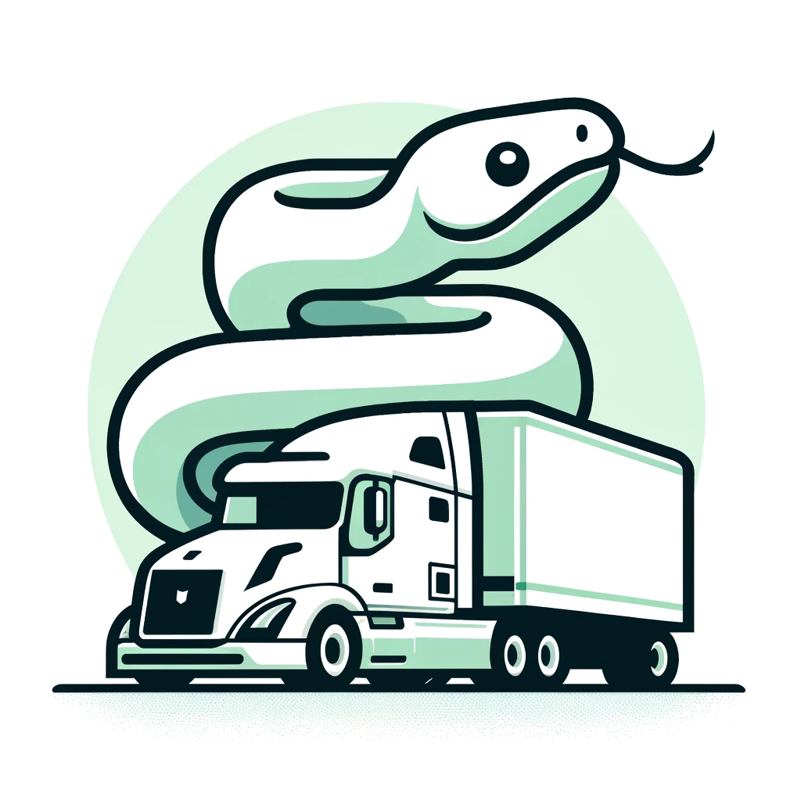

# Python Workshop for LCL Logistics

## Overview

LCL Logistics, a global leader in integrated logistics and transport solutions, specializes in managing and transporting perishables efficiently across multiple destinations. Established in 2001, LCL Logistics leverages a vast network of global partners and advanced technologies to deliver outstanding service. This workshop aims to enhance their operational efficiency, data handling, and decision-making capabilities through Python programming.

## Benefits of Python for LCL Logistics

- **Operational Efficiency**: Python's versatility in data analysis and automation can optimize logistics workflows and route planning.
- **Data Handling**: Through advanced SQL processing and API integrations, Python helps manage complex data queries and interactions with external data sources.
- **Decision Making**: ORM and database management enhancements will allow for more efficient operations and deployment of logistics applications.

## Workshop Sessions

### Day 1: Setup and Core Python Applications
- **Session 1: Workshop Goals and Getting Set Up**
  - Introduction to the workshop’s objectives.
  - Setting up development environments and accessing the GitHub repository.

- **Session 2: SQL Processing and Database Connections**
  - Overview of SQL and its importance in data handling.
  - Hands-on: Connecting Python to SQL databases and executing queries.

- **Session 3: Building Reports for Business Intelligence**
  - Using Python for high-level business intelligence reporting.
  - Complex data manipulation techniques with `pandas` and `matplotlib`.

- **Session 4: API Solutions**
  - Introduction to APIs and how to integrate them using Python.
  - Practical exercise: Consuming a REST API and using the data in a Python application.

### Day 2: Advanced Topics and Front-End Integration
- **Session 5: Quick Touch on Front End**
  - Basics of integrating Python applications with front-end technologies.
  - Simple demonstration using Flask to create a web interface.

- **Session 6: ORM Solutions / Usage**
  - Understanding Object-Relational Mapping with SQLAlchemy.
  - Example: Mapping Python classes to database tables.

- **Session 7: Packaging and Deploying Solutions**
  - How to package Python applications and prepare for deployment.
  - Deploying a simple Python application to a cloud platform like Heroku.

- **Session 8: Monitoring Tools, Logging, and Error Handling**
  - Implementing logging in Python applications.
  - Overview of monitoring and error handling techniques.

### Day 3: Advanced Python Techniques
- **Session 9: Decorators and Dunder Methods**
  - Introduction to decorators and their applications.
  - Understanding and using Python's double underscore (dunder) methods.

## Additional Workshop Elements

- **Hands-on Exercises**: Each session includes practical exercises to solidify learning.
- **Q&A Sessions**: Scheduled time for participants to ask questions and discuss applications.
- **Take-home Assignments**: For further exploration of the topics discussed.

## Conclusion

This workshop is designed to empower the LCL Logistics team with Python skills that will improve their logistics and transport solutions, leading to better cost management and more reliable service delivery.

